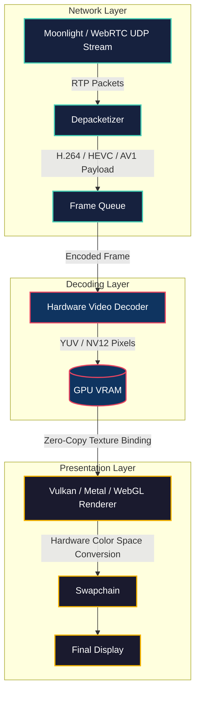
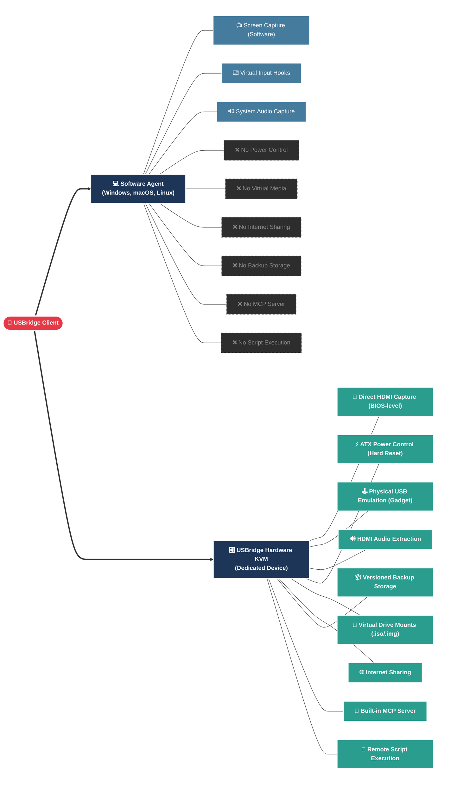

# 🚀 USBridge Remote Client

<p align="center">
  <strong>The ultimate high-performance, cross-platform remote control client for USBridge 2.</strong><br>
  Built from the ground up in Go, featuring a zero-copy hardware video rendering pipeline, seamless Tailscale/WebRTC networking, and uncompromised security.
</p>

## ✨ Why it's Awesome

- **Pure Native & Cross-Platform**: Runs natively on **Windows, macOS, Linux, Android, iOS**, and directly in the browser via **WebAssembly (WASM)**.
- **Ultra-Low Latency Video**: Integrates the Moonlight/Sunshine streaming stack directly into native UI using **Vulkan** and **Metal**. Pure hardware decoding and rendering with zero subprocess or IPC overhead.
- **Secure Master QR Sync**: Instant one-scan connection. Scan the QR code to securely exchange API secrets, pair Moonlight, and bring up a direct Tailscale tunnel automatically.
- **NBD Virtual Media**: Mount local `.iso` or `.img` files and stream them directly as virtual USB drives to the remote host via the NBD protocol.
- **Uncompromised Input Control**: Complete translation of keyboards, multi-touch gestures, gamepads, and relative/absolute mouse positioning across all platforms.

---

## 🌐 Zero-Install Web Client (WASM + WebRTC)

The USBridge Client doesn't just run as a desktop app—it compiles entirely to **WebAssembly** so you can control your devices directly from any modern web browser without installing anything.

- **WebRTC Streaming**: Bypasses traditional UDP Moonlight streams by utilizing **WebRTC**. Encoded video frames traverse NATs and firewalls seamlessly via STUN/TURN, delivering ultra-low latency video straight to the HTML5 `<video>` element without requiring any VPN software.
- **Browser-Native Decoding**: WebRTC leans on the browser's own hardware-accelerated MediaCapabilities, meaning the web client achieves native-level decoding performance and battery life.
- **Tailscale on the Web**: Because the browser sandbox restricts direct raw network socket control (meaning we cannot run a user-space Tailscale node directly inside the WASM environment), the client replaces the Tailscale IP entry field with a notice prompting users to download and run the native Tailscale client on their host device (`tailscale.com/download`). Once active on the host, Tailscale-routed IPs can be entered directly into the primary IP input field.

---

## 🏎️ The Hardware-Accelerated Video Pipeline

Unlike typical remote desktop clients that decode frames to system RAM and copy them back to the GPU for display, the USBridge Client keeps everything entirely on the GPU. From the moment a frame is decoded to the moment it hits your screen, it never leaves video memory.

### Frame Processing & Rendering Architecture



**How it works:**
1. **Network**: Encoded frames arrive over ultra-low latency UDP (via the Moonlight protocol or WebRTC data channels for the web client).
2. **Decode**: Native OS hardware decoders (MediaFoundation, VideoToolbox, V4L2, MediaCodec) slice through the HEVC/H.264 stream.
3. **Render**: The decoded NV12/YUV textures in VRAM are bound directly to **Vulkan** (Linux/Windows/Android) or **Metal** (macOS/iOS) framebuffers. Custom shaders handle YUV-to-RGB conversion on the fly. No CPU overhead, zero frame drops.

---

## 🔐 Connection Flow (Protocol v2)



---

## 🖱️ Advanced Input & Mouse Modes

The client bridges the gap between touch devices and physical hardware interfaces:
- **Touchpad Mode (Relative)**: Emulates a high-precision laptop touchpad, converting screen swipes into relative USB mouse movements.
- **Absolute Mode**: Maps the client screen directly to the remote screen coordinate space for instantaneous 1:1 pointing (great for tablets and styluses).
- **Virtual On-Screen Controls**: Dynamic IME tracking and custom gamepad layouts for mobile devices.

## 🧠 Local ui.parse Offload (experimental)

The MCP `ui.parse` tool (icon detection + text detection/recognition for
agent-driven UI automation) normally runs on the device's RK3566 NPU,
which tiles text detection into several passes at 1080p and can take
~20s. On a machine with a real CPU/GPU, the same three ONNX models
(icon detector + DBNet + SVTR) can run locally in well under 5s instead,
via ONNX Runtime — accelerated with CoreML on macOS, DirectML on Windows
(any NVIDIA/AMD/Intel GPU, no vendor SDK needed), or OpenVINO on Linux
(Intel iGPUs); see `internal/localui/onnx.go`'s `acceleratorEP`.

A packaged macOS or Windows build (`scripts/build_macos.sh` /
`build_windows.sh`) already bundles a redistributable ONNX Runtime (+
DirectML.dll on Windows) + the models straight into the app — turning on
`local_ui_parse_enabled` just works, no per-machine setup (see
`scripts/fetch_onnxruntime.sh`). The Windows/DirectML path is
independently verified: benchmarked live on an NVIDIA RTX 3090 + AMD Radeon
780M iGPU dev box, a ~2.5x end-to-end win over CPU (see
`internal/localui/onnx.go`'s `acceleratorEP` doc comment for exact
numbers) with DirectML correctly binding to the discrete GPU. `build_linux.sh`
bundles the same way but that path isn't independently verified on a real
Linux machine yet. Building from source (`go run`/`go build` instead of a
packaged app), fetch the runtime lib once instead -- the ONNX models are
already committed at `internal/localui/models/`, only the ONNX Runtime
shared library itself needs fetching:

```bash
./scripts/fetch_onnxruntime.sh ~/.usbridge/localui/runtime   # once per machine, any OS: onnxruntime.dll/.so/.dylib (+ DirectML.dll on Windows)
mkdir -p ~/.usbridge/localui/models && cp internal/localui/models/*.onnx ~/.usbridge/localui/models/
# then enable it in your config:
#   "local_ui_parse_enabled": true
```

`./scripts/setup_localui.sh` is a separate, heavier script for Linux dev
machines specifically: it additionally installs the OpenVINO execution
provider (`onnxruntime-openvino`, Intel iGPU only) and re-exports the three
models from their original PaddleOCR/ultralytics sources via Docker+
paddle2onnx -- only needed to regenerate the models after an upstream
update, not for normal local-offload setup on any platform.

When enabled, the MCP proxy (`internal/api/mcp_proxy.go`) answers
`ui.parse` itself instead of forwarding to the device — see
`internal/localui`'s package doc comment for the full pipeline, and
`cmd/localui_bench` for a standalone benchmark/verification tool. Off by
default; falls back to the device path automatically if models/runtime
aren't installed.

### AI Vision live overlay

With local ui.parse offload enabled, the "AI Vision" checkbox next to
resolution/bitrate in the video start dialog burns the same Set-of-Mark
detection boxes + hex ids onto the *live* video feed (throttled to one
detection pass every ~2s — see `internal/service/ai_vision.go`) instead of
just a static screenshot: you see exactly what an agent's `ui.parse` call
would see and how it would address each element, overlaid on the moving
picture. Off by default.

How it reaches the screen depends on whether the platform's video path is
zero-copy: Linux (Vulkan) and macOS's CPU-fallback decode path draw
straight into the CPU-owned RGBA frame buffer before it reaches the GPU.
macOS's normal zero-copy Metal path (`metal_video_try_submit`, the common
case) never produces a CPU-writable frame at all — that path composites
the detection as its own transparent `CALayer` stacked above the video
IOSurface layer instead (see `metal_video_impl_darwin.m`'s
`g_overlay_layer`), at zero per-frame cost. Not yet wired into Android's
or Windows' Vulkan zero-copy paths, or iOS.

## 🛠️ Build & Dependencies

Detailed compilation instructions and environment setup for all target platforms (Linux, macOS, Windows, Android, iOS, WASM) are located in the `scripts/` folder.

To trigger a quick WASM web build:
```bash
./scripts/build_web.sh
```

## 📚 Documentation

**[docs/README.md](docs/README.md)** is the full index — interface guide (what each tab does, and what's hardware-KVM-only vs. available on a software Agent), platform notes, and the protocol/security reference:
- [`docs/interface-guide.md`](docs/interface-guide.md) — Control, Devices, Snapshots, and Scripts tabs explained.
- [`docs/api_endpoints.md`](docs/api_endpoints.md) — The secure API and Master QR sync protocol specification.
- [`docs/MOUSE_TOUCHPAD.md`](docs/MOUSE_TOUCHPAD.md) — Mathematical specifics of relative/absolute pointer translation.
- [`docs/NATIVE_VIDEO_AUDIO.md`](docs/NATIVE_VIDEO_AUDIO.md) — Comprehensive details on the Vulkan, Metal, and Moonlight integration stack.

## 📜 License

This project is licensed under **GPLv3** (see `LICENSE`). The client incorporates code from `moonlight-common-c` (also GPLv3).
